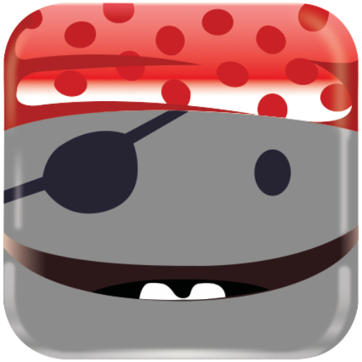

<h3 align="center"></h3>
<h3 align="center">Beep, Beep, Yarrh! </h3>

## Robo pirate
I am the robot servant for the [Coding Pirates](https://Codingpirates.dk) slack
channel. My purpose is to aid in the communication for all the volunteers in
Coding Pirates.

### My tasks
Below you see a list of the task I either intend to learn or already can do.

- [x]  **Post when new channel is created:** Once a new channel is created I
should post the name of the channel along with a link to it in the
#announcements channel.
- [ ] **Welcome new people:** Once a new user joins our slack they should be
greeted with a welcome message and instructions on how we use slack.
- [ ] **Check for profile description:** Since we are so many people in our
slack we want people to write their department in their profile. I will write
them a friendly reminder until they do it.
- [x] **Decisions:** The board of Coding Pirates uses slack to make decision
between meetings. If people type
`@robo-pirate Vote [public | private] Should we give the bot more rum?`.
I will create a new message and ask people to vote in the message thread.
If the decision reaches a majority vote I will post the vote results to a
specified decision channel. The `[public| private]` flag decides on if I post to
a public or private decision channel.
""`  

### Setup
If you want to develop on the bot you need to fill in token in
`config/config.exs`. This can be done by creating your own slack for testing
purposes. Slack has nice [guide][guide] for setting up a test environment with
`ngrok`. You must configure a URL for the events API as described in their
[tutorial](https://api.slack.com/events-api).

### Contributing
Pull requests are more than welcome, if you want to discuss the development
either create an issue or jump into our slack and ask in `#robo-pirate-dev`  

[guide]: https://api.slack.com/tutorials/tunneling-with-ngrok
